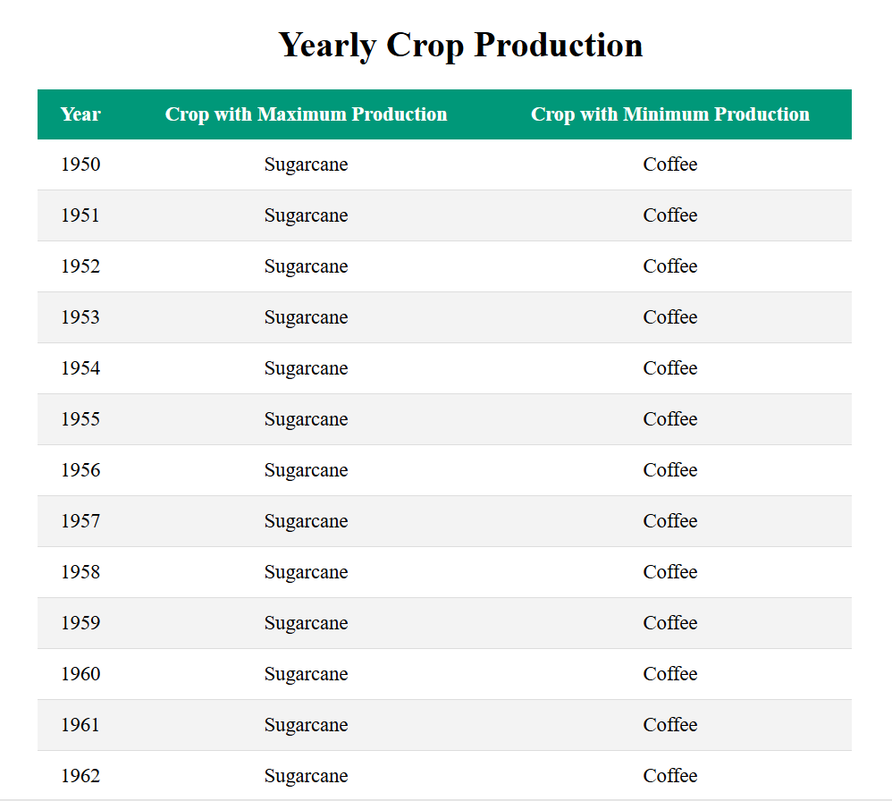
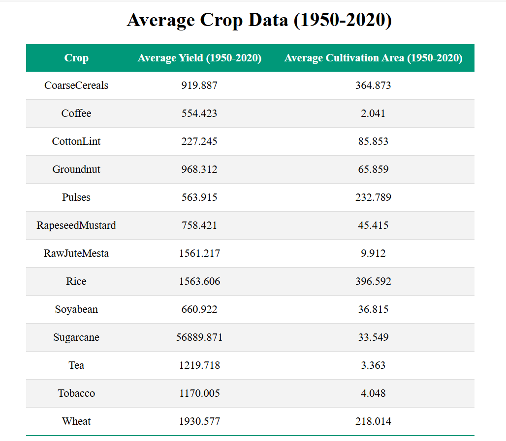

# Agriculture Data Dashboard

*Table 1: Yearly Crop Production*


*Table 2: Average Crop Data (1950-2020)*


This project displays agricultural data in two tables using React with TypeScript and Mantine components.

## Getting Started

To get started with this project, follow the steps below:

### Prerequisites

Before you begin, make sure you have the following installed on your system:

- [Node.js](https://nodejs.org/) (version >= 12.0.0)
- [Yarn](https://yarnpkg.com/) (latest)

### Clone the Repository

Clone the repository to your local machine:

```bash
git clone <repository-url>
cd <project-directory>
```

### Install Dependencies

Navigate into the project directory and install dependencies:

```bash
yarn install
```

### Install Mantine Dependencies

Install Mantine components used in the project:

```bash
yarn add @mantine/core @mantine/hooks
```

### Start the Application

Start the development server and open the app in your default browser:

```bash
yarn start
```

The app will be available at http://localhost:3000.
